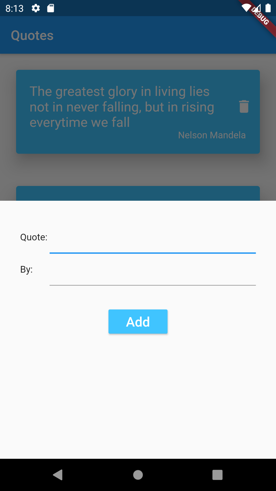

<h1>Quotes Application</h1>
This is a simple flutter application that allows us to write to/read from Firebase Firestore
 
<h2> Screenshot -</h2> 

<b>Things I learned</b> 
<ul>
<li> Connection to Firebase
<li> Adding data to Firebase
<li> Deleting data from Firebase
</ul>

